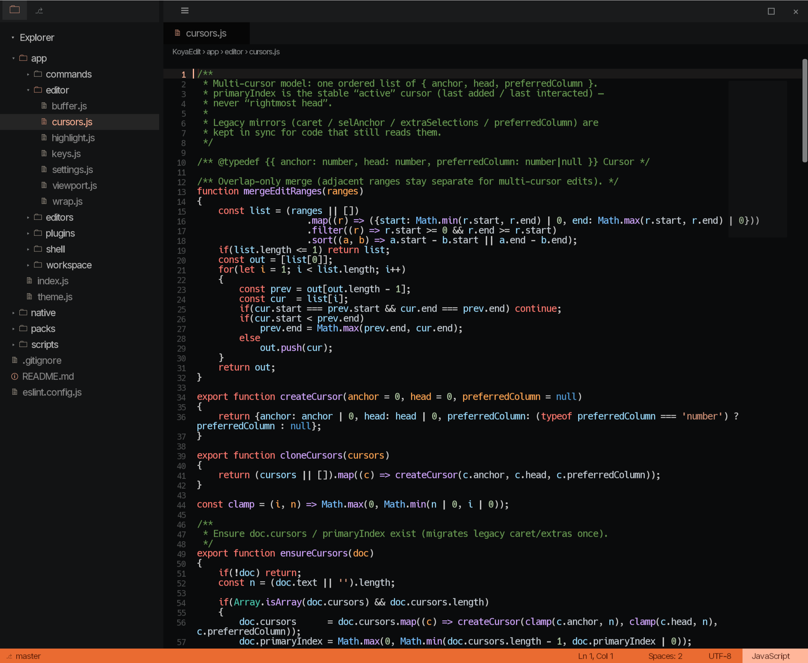

# KoyaEdit

A Wayland text editor built on [Koya](https://www.koya-ui.com/). Not because the world needed another editor. Because I needed one that wasn't VS Code.



## Why this exists

Three reasons. None of them are "disrupt the IDE market."

### 1. Stress-test Koya

[Koya](https://www.koya-ui.com/) is meant to replace Electron. Fine. Talk is cheap. Text rendering is not.

If you want to find out whether a UI runtime can actually carry a desktop app, you make it draw thousands of glyphs, scroll, reflow, highlight, blink carets, and not fall over when someone opens a real file. That's a nastier workout than another settings panel or a demo that fits in a screenshot.

KoyaEdit is that workout. The scripting model, the layout system, the Vulkan path; all of it gets exercised by something I have to live in. If the engine can't do an editor, it can't do the class of apps people actually ship.

### 2. I'm done with Electron

I'm sick of VS Code. More precisely: I'm sick of the whole stack it sits on. Chromium as an application runtime. A megabyte of JavaScript to move a caret. Extensions that feel like a second OS. Memory charts that look like a hostage situation.

Koya is faster, leaner, and closer to the metal. So the obvious move is to stop complaining and build the tool I want to use.

This isn't a spiritual rejection of web tech for its own sake. It's practical. I want an editor that belongs on the desktop I'm already running, not a browser that happens to edit files.

### 3. Everyday regression testing

Automated tests catch the failures you already thought of. Daily use catches the ones you didn't.

As Koya moves, subtle faults show up; a flicker after resize, a caret that lies about its position, a scroll path that only breaks on long lines. Those slip through suites because nobody wrote the weird case yet. Sitting in the editor for real work surfaces them faster than any harness I've bothered to maintain.

So yes: this is also a canary. A useful one, because if it breaks, I notice before anyone else has to.

## What it is

A basic Wayland IDE shape:

- File tree, tabs, status bar
- Multiline editor with soft wrap, multi-cursor, undo
- Tree-sitter highlighting (JS, C/C++, and friends via packs)
- Soft-mounted plugins (git SCM, image viewer, markdown preview, …)
- Native gap-fill for host FS / process (`Module/editor`); Koya's VFS stays for app assets

It's early. It edits text. It doesn't pretend to be your whole career.

## Run it

Koya is closed-source. Get a runtime from the [install docs](https://developer.koya-ui.com/install/) (tarball or distro package). Prefer **0.2.2+**. You also need a Wayland session and working Vulkan drivers; see [Quickstart](https://developer.koya-ui.com/quickstart/).

```sh
# native Module/editor (host FS / process / highlighting)
cmake -S native/editor -B native/editor/build
cmake --build native/editor/build -j

# launch (uses `koya` on PATH, or KOYA_BIN)
./scripts/run.sh /path/to/workspace
```

`scripts/run.sh` mounts `app/` and `packs/` into `/rom`, loads `libsm-editor.so` via `-n`, and starts `index.js`; the same mount/native flags documented under [Koya/Runtime](https://developer.koya-ui.com/koya-runtime/). Override the binary with `KOYA_BIN=/path/to/koya` if it isn't on your PATH.

### Shortcuts (the useful ones)

| | |
|---|---|
| Ctrl+Shift+P | Command palette |
| Ctrl+S / Ctrl+Shift+S | Save / Save As |
| Ctrl+N | New untitled |
| Ctrl+W | Close tab |
| Ctrl+D | Select next occurrence |
| Ctrl+click / drag | Add selection |
| Ctrl+C / X / V / A | Clipboard / select all |

## Layout

```
KoyaEdit/
  app/              # JS UI (mounted at /rom)
  native/editor/    # Module/editor (libsm-editor.so)
  packs/            # highlight + feature plugins
  scripts/run.sh
```

Feature packs soft-mount under `/rom/plugins/<id>/`. Core discovers them; it doesn't hard-import your git UI. Highlight packs live separately under `packs/plugins/highlight/`.

## Status

Built for my workflow on Wayland. If it helps you prove something about Koya, or you just want an editor that isn't a browser; good. If you need IntelliSense, remote containers, and a marketplace full of emoji themes, you already know where to find those.
